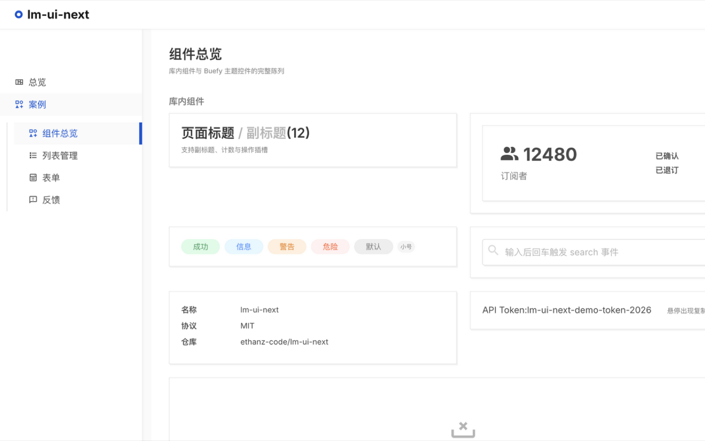

<div align="center">


# lm-ui-next

**A Vue 3 admin UI kit that recreates the ListMonk look & feel**

Vue 3 · TypeScript · Buefy (Vue 3 port) · Bulma · rolldown-vite

[](./LICENSE)

</div>

---

lm-ui-next distills the clean, understated design language of the [ListMonk](https://github.com/knadh/listmonk) admin panel into a reusable Vue 3 component library — hardcoded blue, flat "hard shadow" cards, color-bar notifications, pill status tags, and the signature sidebar active-state.



> [!NOTE]
> The theme in `src/lm-ui/styles/lm.scss` is an **independent implementation** built from ListMonk's visual design (colors, spacing, shadows). No ListMonk source code is included, so this project is MIT licensed.

## Highlights

- **Faithful sidebar semantics** — two-level collapsible menu; active leaf gets the blue right bar, active group gets blue text on a soft grey fill, sub-lists carry a left rule and auto-expand.
- **TypeScript end to end** — every component is `<script setup lang="ts">` with typed props, emits and exported interfaces.
- **Batteries included theme** — one SCSS file re-skins all of Buefy (tables, modals, toasts, dialogs, switches, progress, tabs, tag inputs) to match.
- **Fast tooling** — powered by [rolldown-vite](https://github.com/rolldown/vite) (the Rust-powered Vite engine), dev server ready in ~600 ms.

## Quick start

```bash
npm install
npm run dev
```

Open http://localhost:9200 — the bundled example app demonstrates the dashboard, a CRUD list page, forms and feedback patterns.

## Use in your own project

Copy `src/lm-ui/` into your project, then:

```ts
// main.ts
import { createApp } from 'vue';
import '@mdi/font/css/materialdesignicons.min.css';
import './lm-ui/styles/lm.scss';
import LmUI from './lm-ui';
import App from './App.vue';

createApp(App).use(LmUI).mount('#app');
```

Peer requirements: `vue ^3`, `bulma ^0.9`, `@ntohq/buefy-next`, `@mdi/font`.

### Components

| Component | Purpose |
| --- | --- |
| `LmPageHeader` | Page title with subtitle, counter and action slot |
| `LmSidebar` | Two-level collapsible nav with ListMonk active semantics |
| `LmStatTile` | Dashboard metric tile (icon + big number + breakdown) |
| `LmCard` | White card with hard shadow, header / footer slots |
| `LmSearchBox` | Input + primary search button combo |
| `LmStatusTag` | Pill status tag (`success` / `info` / `warning` / `danger`) |
| `LmFields` | Label/value detail grid |
| `LmCopyText` | Copy-to-clipboard with hover affordance |
| `LmEmptyPlaceholder` | Friendly empty state |

## Design tokens

| Token | Value |
| --- | --- |
| Primary | `#0055d4` |
| Success | `#36995b` |
| Danger | `#FF5722` |
| Warning | `#ed7b00` |
| Base font | Inter, 15px |
| Card | white + `1px #e6e6e6` border + `2px 2px 0 #f3f3f3` shadow |

> [!TIP]
> Buefy compiles some utilities from its own default turquoise palette. The theme re-asserts the primary color for switches, progress bars and text utilities — if you add new Buefy widgets, check them against this list first.

## Example pages

| Route | Demonstrates |
| --- | --- |
| `/` | Stat tiles, recent-activity table, status tags |
| `/components` | **Full component gallery** — every library component and themed Buefy widget |
| `/lists` | Search, bulk select, edit modal, delete confirm, dual pagination |
| `/form` | Inputs, select, tag input, switch, checkbox |
| `/feedback` | Color-bar notifications, toasts, confirm dialog, tabs, progress |
